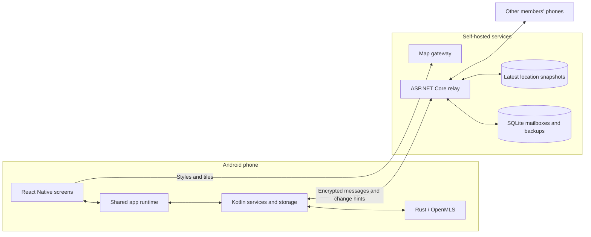

# Family Circle

Family Circle is an Android app for private group chat and optional location sharing. Send messages, photos, videos, files, and voice notes in a circle, or open its map to see members who have chosen to share their location.

The phone encrypts messages and locations before sending them to a self-hostable relay. Accounts use a recovery phrase, so there is no email-and-password signup.

Much of the work in this project is about what happens between those everyday actions: a phone loses its connection, a message is retried, an app restarts, or someone leaves while another member is offline. The Rust core, Android services, and relay work together to keep those transitions consistent.

**Built with:** React Native · TypeScript · Expo · Kotlin · Rust / OpenMLS · ASP.NET Core · SQLite · MapLibre

[Why I made this](#why-i-made-this) · [Demo](#demo) · [How it works](#how-it-works) · [Engineering decisions](#engineering-decisions) · [Run locally](#run-locally) · [Tests](#tests) · [Current limitations](#current-limitations)

## Why I made this

I started Family Circle to build a location-sharing app for my own use, with self-hosting and clear control over how location data is shared. I wanted to choose who could see my location and for how long, while running the service on infrastructure I manage.

I also wanted code I could read and change as my needs change. Chat makes it easier to keep everyday conversations in the same app as location sharing.

## Demo

These recordings use two Android emulators. All identities and recovery phrases shown belong to disposable test accounts. Each link opens a WebM recording.

| Walkthrough | What happens | Video |
| --- | --- | --- |
| Setup | Create an identity, save its recovery phrase, and configure the app. | [setup.webm](https://github.com/user-attachments/assets/86105c53-fe23-4882-ac08-3acb2aaa7c63) |
| Circle membership | Create a circle, join it from another device, and leave. | [create-join-leave-circle.webm](https://github.com/user-attachments/assets/1ef97db9-5df0-4bd0-ae6a-c3399e20eac5) |
| Location and attachments | Send a video attachment and share locations between two devices. | [location-sharing-and-video-attachments.webm](https://github.com/user-attachments/assets/3de2da3b-a64a-4e50-a196-62f381e762c5) |
| Coming back online | Send while offline, reconnect, and remove a member while their device is disconnected. | [offline-messaging-and-member-removal.webm](https://github.com/user-attachments/assets/3469b540-4288-4a37-bfad-11cd544e913e) |
| Recovery | Restore an identity using its recovery phrase. | [seed-phrase-recovery.webm](https://github.com/user-attachments/assets/faa412ab-2870-4896-97b2-b253a390a57d) |

## What you can do

- Create circles, invite people with a code, approve rejoin requests, remove members, and transfer administration.
- Send text, photos, videos, files, and voice messages. Reply, react, edit, and delete messages.
- Choose how long to share your location and how often to update it. Stop sharing from the app or its Android notification.
- Queue messages during connection loss and send them after reconnecting.
- Recover an identity and its saved group state with a 12-word phrase. Chat history stays on the original phone.
- Set a nickname and profile photo, choose a light or dark theme, and configure notifications and quiet hours per circle.

Invitations can be shared as a code or QR code. Scanning asks for camera permission; entering a code works without it.

## How it works

Each circle is an encrypted group managed with Messaging Layer Security (MLS). The phone keeps the identity, keys, and conversation state. The relay stores encrypted messages in ordered mailboxes and tells connected phones when something changes.



| Part | What it owns | Start reading |
| --- | --- | --- |
| App runtime | Circle membership, outgoing messages, delivery receipts, and synchronization | [circles.ts](mobile/src/runtime/circles.ts) |
| Android bridge | Native services, permissions, notifications, and durable local storage | [family-circle-bridge](mobile/modules/family-circle-bridge/android/src/main/java/expo/modules/familycirclebridge) |
| Rust core | Group encryption, membership authority, invitation encryption, and recovery | [lib.rs](crypto-core/src/lib.rs) |
| Relay | Mailbox ordering, duplicate handling, backup access, and request limits | [Program.cs](relay/Program.cs) and [Endpoints](relay/Endpoints) |
| Map gateway | Local fonts, sprites, and styles, with local or hosted tiles | [serve.py](infra/maps/serve.py) |

The mobile code is split into screen features, runtime operations, and persistence modules. React providers subscribe to the runtime, while Android services can keep it working without an open screen. The [mobile guide](mobile/README.md) explains where to find things and how to test changes. On the relay, routes, request limits, database setup, and background cleanup live in separate modules.

An invitation expires after ten minutes and can be used once. The joining phone supplies its public key package; the administrator's phone processes the request and sends back the encrypted group state. A device that was explicitly removed needs administrator approval to return. The administrator must be online for admission to finish.

## Engineering decisions

### Save before sending

Encrypting a message advances local protocol state. Sending it before saving that state would leave the phone in trouble if it crashed immediately afterwards.

The app commits its encrypted state and outgoing queue together before uploading anything. A retry uses the same saved envelope and event ID. If a local transaction fails, the app restores its previous in-memory state.

The [chat persistence module](mobile/src/persistence/chat.ts) owns the transaction journal, checkpoints, and outgoing queue, and [ChatRuntime](mobile/modules/family-circle-bridge/android/src/main/java/expo/modules/familycirclebridge/ChatRuntime.kt) writes the native checkpoint atomically.

### Use notifications to trigger a catch-up

A SignalR notification means there may be new work in a mailbox. The phone then fetches messages using its saved position in that mailbox. It can recover from a missed notification by catching up later.

The [relay notification service](relay/Services/SyncNotifications.cs) combines repeated change notifications. The [client coordinator](mobile/src/sync-coordinator.ts) combines overlapping requests into another synchronization pass.

### Confirm membership changes in message order

Adding or removing someone changes the group's encryption epoch. The Rust core prepares that change, saves it, and waits for its exact commit to appear in relay order before accepting the new state. Recipients also check that the commit came from the circle's administrator.

The tests cover [competing commits and restarts](crypto-core/tests/staged_membership.rs), [unauthorized membership changes](crypto-core/tests/membership_authority.rs), and [offline catch-up](crypto-core/tests/chat_restart_diagnostic.rs).

### Keep location updates out of chat history

Location sharing uses a separate channel of signed, encrypted snapshots. Each new snapshot replaces the previous one on the relay. Stopping or expiring a session leaves a terminal record so an old upload cannot bring it back.

The [Rust location code](crypto-core/src/location.rs) handles session keys and consent. The [relay tests](relay/tests/LocationTests.cs) cover forgery, expiry, and races between stopping and updating a session.

## Run locally

The setup below targets Linux x86-64 with two Android devices or emulators that can reach the development machine. Expo Go cannot load the custom Rust/Kotlin bridge.

The build was checked with these tools on September 16, 2026:

| Tool | Version used |
| --- | --- |
| Rust | 1.98.1 |
| Node.js / npm | 26.8.1 / 11.19.0 |
| .NET SDK | 10.0.401 |
| Java | OpenJDK 21.0.12.1 |
| Android SDK / build tools | API 36 / 36.0.0 |
| Android NDK | 27.2.12479018 for Rust; 27.1.12297006 for the generated Android project |

You also need Python 3.11 or newer. Set `ANDROID_HOME`, `ANDROID_NDK_HOME`, and `JAVA_HOME` to your local installations. The native build script produces ARM64 and x86-64 libraries.

### 1. Build the Rust library and Kotlin bindings

From the repository root:

```bash
cargo install cargo-ndk
rustup target add aarch64-linux-android x86_64-linux-android
bash crypto-core/build-android.sh
```

Wait for this script to finish before building Android. The bridge needs both the compiled libraries and the generated bindings.

### 2. Install dependencies and configure the services

```bash
cd mobile
npm ci
npm run detect-lan-ip
cd ..

python3 infra/maps/prepare.py
cd infra/maps
npm ci
PUBLIC_MAP_URL=http://YOUR_LAN_IP:8090 MAP_MAX_ZOOM=6 npm run styles
cd ../..
```

Replace `YOUR_LAN_IP` with the address printed by `detect-lan-ip`. The detector writes the relay and map URLs to `mobile/.env`, which Git ignores. `EXPO_PUBLIC_*` values are included in the app bundle, so they must never contain secrets.

The default map download covers the world through zoom level 6. For street detail, use a full map archive or hosted Protomaps tiles. Hosted mode uses `prepare.py --hosted`, `MAP_MAX_ZOOM=15`, and the server settings in [infra/maps/.env.example](infra/maps/.env.example). Keep its API key on the server.

### 3. Start the relay and map gateway

Run each service in a separate terminal from the repository root:

```bash
dotnet run --project relay --launch-profile LanDemo
```

```bash
python3 infra/maps/serve.py
```

The relay listens on port `5080`; maps use `8090`. This configuration uses HTTP for development on a private network. A public deployment needs HTTPS and a server enrollment secret. Stop either service with Ctrl+C in its terminal.

### 4. Build and install the app

```bash
cd mobile
npm run android
```

Create an identity on each phone, create a circle on the first, and enter its invite code on the second. Then send a message, disconnect one phone, send another, and reconnect it.

The npm scripts detect the LAN address again before starting or building the app. **For custom URLs**, copy [mobile/.env.example](mobile/.env.example) to `mobile/.env`, edit the values, and use `npx expo run:android` or `npx expo start --dev-client` directly to avoid overwriting them.

If an HTTP service address changes, run `npx expo prebuild --platform android --no-install` and rebuild the app so its native network configuration uses the new host. Regenerate the map styles with the new address too.

## Tests

From the repository root, after installing the dependencies:

```bash
./scripts/run-all-tests.sh
```

This runs the Rust, relay, mobile, map gateway, Android bridge, and emulator-runner tests, plus TypeScript checking. It builds the Rust Android libraries for the bridge tests and starts an isolated relay for the HTTP scaling test with 10, 20, and 50 members. Use `--skip-android` if the Android toolchain is unavailable, or `--skip-scaling` to leave out the longer scaling run. The script prints a result for each suite and exits with a failure status if any suite fails.

For individual suites:

```bash
cargo test --workspace
dotnet test relay/tests/FamilyCircle.Relay.Tests.csproj -p:IsTestProject=true
python3 -m unittest discover -s infra/maps -p 'test_*.py'
python3 -m unittest discover -s scripts/tests -p 'test_*.py'
npm --prefix mobile test
npm --prefix mobile run typecheck
```

To run the Android bridge tests, start from the repository root after building the Rust library:

```bash
cd mobile
npx expo prebuild --platform android --no-install
cd android
./gradlew :family-circle-bridge:testDebugUnitTest
```

The mobile tests cover persistence and rollback, retries, background synchronization, membership transitions, payload validation, and chat and map interactions. They replace native and network boundaries, so device checks still matter.

For the full two-emulator walkthrough, prepare the map assets, native libraries, generated Android project, and two AVDs, then run:

```bash
bash scripts/run-emulator-smoke.sh --rebuild
```

This builds and installs the app, starts isolated development services, and checks onboarding, invitations, chat actions, location sharing, map gestures, and offline restart. It uses temporary Android users to preserve existing app identities, then cleans up those users and its services. Logs and failure screenshots stay in the run directory under `/tmp`. See the [mobile guide](mobile/README.md#emulator-checks) for prerequisites and smaller checks.

There is currently no CI workflow. These scripts run locally; passing them does not establish real-device battery performance or production capacity.

## Current limitations

The app now separates screen features, runtime state, persistence, and relay endpoints. There is still cleanup to do, especially around the interactions between background work, recovery, and membership changes.

- **Android only.** iOS and web do not have the native bridge needed to run the app.
- **Circle renaming needs a receiver-side permission check.** The UI restricts it to admins, but a modified member client can send a rename that other members accept.
- **Recovery is limited to saved identity and group state.** Chat history is not restored. Backup uploads can lag behind local changes, and an old group state may need a rejoin.
- **Background delivery depends on Android.** Permissions, battery restrictions, force stops, and connectivity can delay messages and location updates.
- **Encryption does not hide all metadata.** The relay sees routing identifiers, timing, sizes, and connections. Map requests reveal the areas being viewed to the gateway and, when used, its tile provider.

This project has not had an independent security audit. SQLite and a single relay keep it straightforward to run; production capacity and battery performance still need measurement.

## Credits

The emoji picker uses fully qualified entries from [Unicode Emoji 16.0](https://unicode.org/Public/emoji/16.0/emoji-test.txt), © 2024 Unicode, Inc., under the [Unicode License v3](mobile/licenses/UNICODE.txt).

Map data comes from OpenStreetMap, with styles and assets from Protomaps. Group encryption is provided by OpenMLS.
